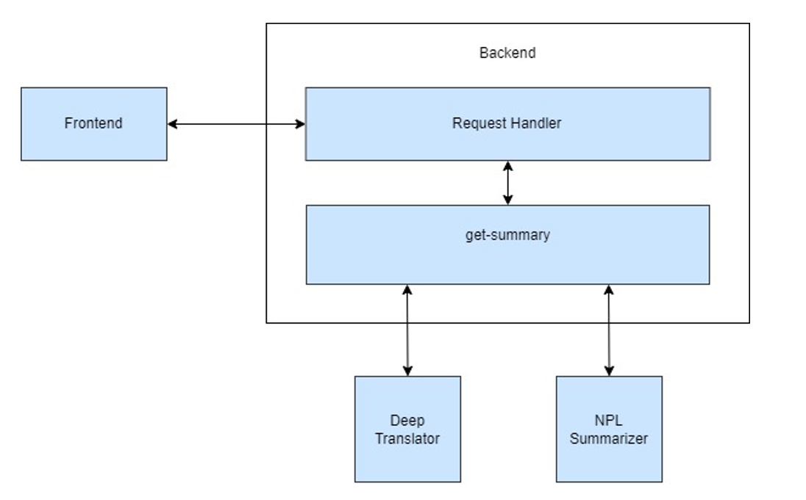
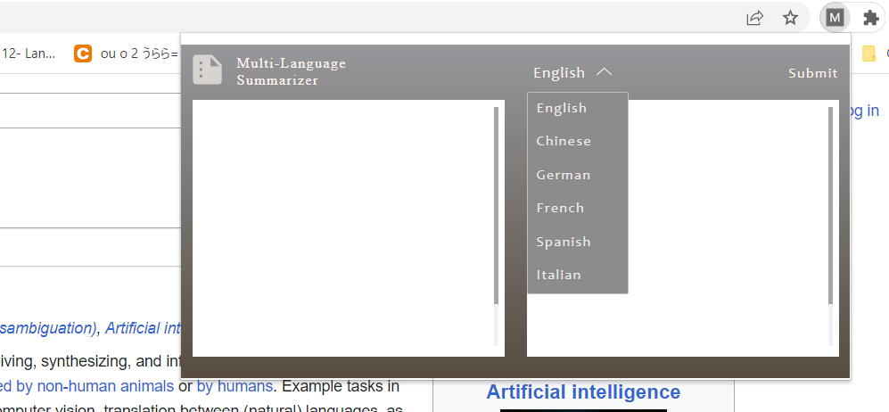
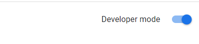
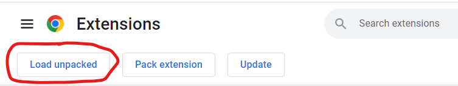
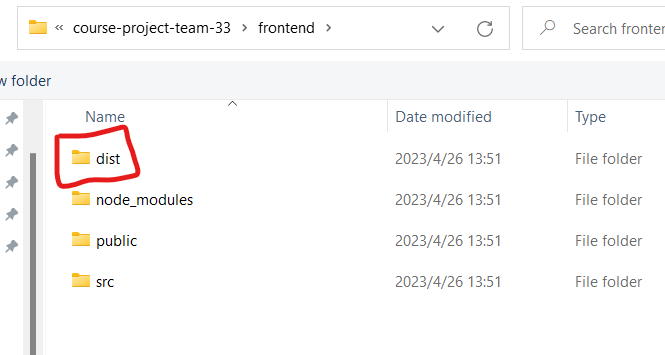

# Multi-Language Summarizer (Team 33)

___Multi-Language___ is a chrome web extension that reduces the amount of time students spend reading complex literature and lengthy articles . The extension has an input text box that allows users to paste their selected text and generate a brief summary. The extension also provides a drop down menu for users to choose their target languages for the summary.

***

## Developed With

* [](https://www.python.org/)
* [](https://www.djangoproject.com/)
* [](https://www.javascript.com/)
* [](https://react.dev/)
* [](https://www.npmjs.com/package/npm)
* [](https://nodejs.org/en)
* [](hhttps://eslint.org/)


***
## Technical Architecture 
  This diagram is the base logic of the technical architecture of the multi-language summarizer

### Frontend:
  - Frontend is developed with `JavaScript ` programming language, `npm`, `Node.js`, and `React` framework. 
  - The React hook, `useState`, is used to manage user state in the application and keep track of the data. The React Testing Library is also used for testing components of the frontend.
  - When user input their selected text, frontend will send a request to the backend. Backend will generate a Json response to the frontend.
  - Frontend applies `html` and `css` to build a comprehensive user interface. 
  - Frontend creates interfaces for summary-translate page with following components:
      1.   Text Box
          - Paste selected text into the text box on the left
          - Click "Submit" button
          - A summary will be generated on the right text box

      2.   Drop-down Menu
          - On the right hand side of the text box 
          - Allows users to selected their preferred language for summary result
  
  

## Backend:
  - Backend is developed with `Python` programming language and `Django` server.
  - To run the server, first thing is to set up the `Django` server:
    #### Prerequisites:

      Before setting up the Django server, you will need the following:

      * Python 3.x (preferably Python 3.6 or higher)

      * pip (Python package manager)     
        virtualenv (optional)

    #### Installation

    1.  Nagivate to `Backend` file
    2.  First, install Django using pip:
        ```bash
        pip install Django
        ```
    3. Then, we need create Django project
        ```bash
        python manage.py startapp MultiLangApp
        ```
    4. Migrate the database
        ```bash
        python manage.py migrate
        ```
    5. Run the server
        ```bash
        python manage.py runserver
        ```
  - Backend creates edge tests and units tests in `MultiLangProject/MultiLangApp/unittests.py`

***
## Installation
1. Clone this repository
    ```
    git clone https://github.com/CS222-UIUC/course-project-team-33.git
    ```
2. Open your Chrome browser and go to `chrome://extensions/`
3. Enable the developer mode
    

4. Click `Load Unpacked` button on the left corner
  

5. Navigate to the `course-project-team-33/frontend/dist`
  

6. Extension should be now installed and can find in extensions list


### Contributors and Roles: 
* We are a group of four and will divided into two sub-teams of two:
* Frontend Team (Tianwei Qing, Carmen Zheng):
    | Tianwei Qing                   |
    | ---------------------------------|  
    | 1.  Added google extension boilerplate and  eslint styling check.   |
    | 2.  Created a prototye-version google extension |
    | 3. Connected frontend and backend |
    | 4. Added language components |
    | 5. Interacted with the backend translation function |

   
    | Carmen Zheng                    |
    | ---------------------------------|  
    | 1.  Local environment Setup (npm and React)  |
    | 2.  Designed user interface (textbox background)   |
    | 3. Integrated the updated backend with frontend and checked the connection|
    | 4. Updated readme.md and installation|

* Backend Team (Zirui Wang, Zihan Ming):
    | Zirui Wang                    |
    | ---------------------------------| 
    | 1. Import Multi-Lang library| 
    | 2.  Built REST API between Client and Server setup   |
    | 3.  Built test cases for  summarizer model functionality |
    
    

    | Zihan Ming                   |
    | ---------------------------------|  
    | 1. Setup Django server   |
    | 2.  Built edge test cases   |
    | 3. Import DeepL library |
    
    

*** 

